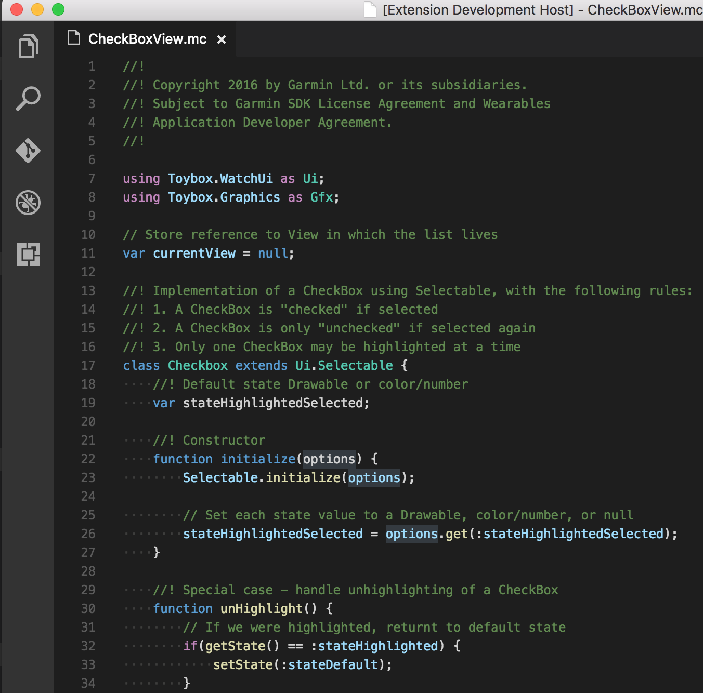

# vscode-monkey-c README

VSCode support for Garmin Connect IQ [Monkey C language](https://developer.garmin.com/connect-iq/programmers-guide/monkey-c/).

## Features

* Basic synax highlighting.

## Requirements

none

## Extension Settings

none

## Known Issues

Not all of the language features implemented yet. Work in progress.

## Release Notes

Very first release. Brings very basic syntax highlighting of Monkey C.

### 0.1.0

Initial release of Monkey C language support.
